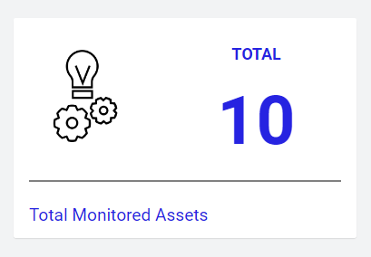

# Cumulocity KPI Overview plugin 

The KPI Overview Plugin is the Cumulocity module federation plugin created using c8ycli. This plugin can be used in Application Builder or Cockpit. It helps you to display the Device KPIs with customised KPI Name, icon, text, color and size.

### Please choose KPI Overview Widget release based on Cumulocity/Application builder version:

| APPLICATION BUILDER &nbsp;| &nbsp;CUMULOCITY &nbsp;| &nbsp; KPI OVERVIEW WIDGET PLUGIN &nbsp;|
|--------------------|------------|-----------------------------|
| 2.0.x              | >= 1016.x.x| 1.x.x                       |

## Features
* Display Device data: Displays Device data kpis for selected Device/Asset.
* KPI Name: Configurable KPI Name with customized color and size.
* Icon: User can choose icon to display for KPI with customized size and color.
* Text: Ability to show brief text for KPI with required color and size.

## Prerequisite
   Cumulocity c8ycli >=1016.x.x
   
## Installation
   
### Runtime Widget Deployment?

* This widget support runtime deployment. Download [Runtime Binary](https://github.com/SoftwareAG/cumulocity-kpi-overview-plugin/releases/download/1.0.0/sag-ps-pkg-kpi-overview-widget-1.0.0.zip) and install via Administrations --> Ecosystems --> Applications --> Packages 
   
## QuickStart
This guide will teach you how to add widget in your existing or new dashboard.

1. Make sure you have successfully installed the plugin.
2. Open you application from App Switcher
3. Click on `Add widget`
4. Search for `KPI Overview` 
5. Select target `asset` or `group`.
6. Click `Save` 

Congratulations! KPI Overview is configured.

In case you see unexpected results on the widget, refer to browser console to see if there are error logs.

## User Guide 

1. `Title` is the title of widget. Provide a relevant name. You may choose to hide this. Go to `Appearance` tab and choose `Hidden` under `Widget header style`.
2. `KPI title` is the name of the KPI you want to show. User has to provide the title for the KPI selected. The title font size and color can be customized. Example: Total, Available.
3. `Upload KPI icon` allows you to upload relevant icon. User can upload an icon of choice for the selected KPI that will be shown in widget and size can be customized. Icon should be a image format like .png, jpg, etc.
4. `KPI` allows you to choose/select one KPI from the list of KPIs in the dropdown. The size and color of the KPI can be customized. The available KPIs are Total Devices, Available Devices, Unavailable Devices, Total Alarms, Major Alarms, Minor Alarms, Critical Alarms, Firmware Risks and any other field of Device..
5. `KPI aggregation interval` is an interval to choose the measurements from to calculate the KPI.
6. `KPI color,KPI Unit color,Title color,Message color`  is the custom color you may want to specify. Clicking this field opens a color picker to help you selecting a color.
7. `KPI unit` User can provide the Unit for the selected KPI with customized font color and size. Leave blank if you don't want to override.
8. `KPI Message ` User can provide a custom message about the selected KPI.
9. `Title Font Size , Image Size, KPI Font Size, Unit Font Size, Message Font Size ` allows you to select relevant font size for respective title,image,Kpi,unit and message.

------------------------------

This widget is provided as-is and without warranty or support. They do not constitute part of the Software AG product suite. Users are free to use, fork and modify them, subject to the license agreement. While Software AG welcomes contributions, we cannot guarantee to include every contribution in the master project.

_____________________
For more information you can Ask a Question in the [TECHcommunity Forums](https://tech.forums.softwareag.com/tags/c/forum/1/Cumulocity-IoT).

You can find additional information in the [Software AG TECHcommunity](https://tech.forums.softwareag.com/tag/Cumulocity-IoT).
